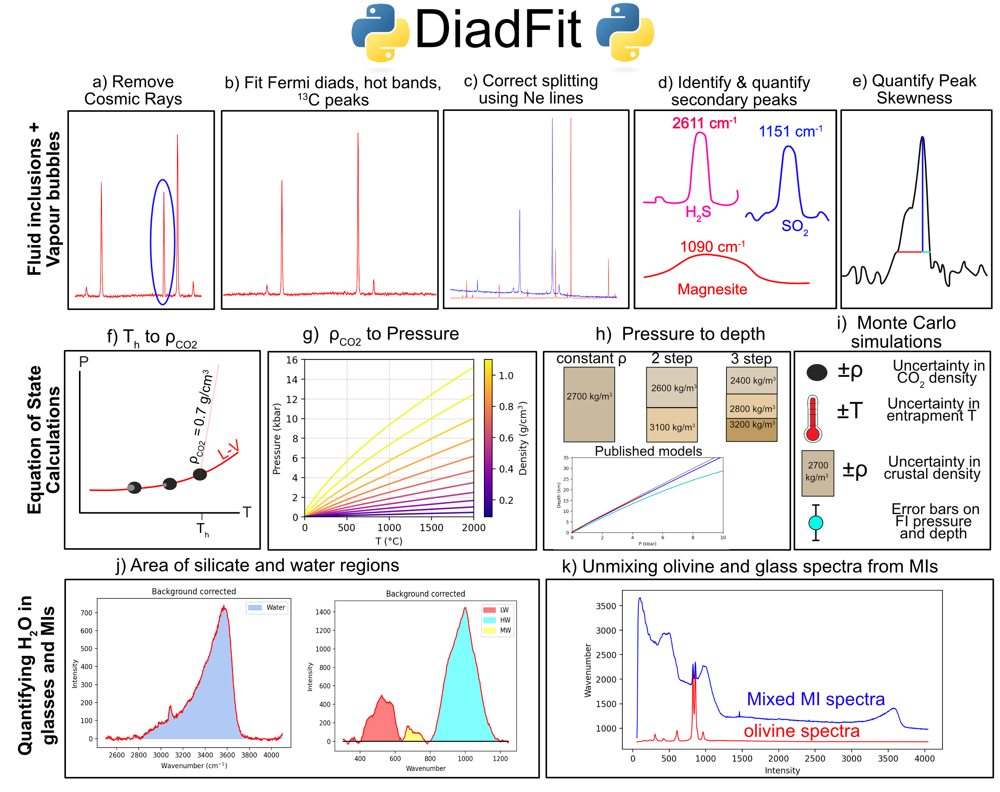

==============================
Introduction and Citation
==============================

Welcome to DiadFit - An Open-Source python3 tool for fitting Raman spectra

This tool is currently in progress, with planned submission to Volcanica in the near future.

We welcome user feedback/requests for new functions to be included. You can either email the lead author (penny_wieser@berkeley.edu), or post a enhancement request/report of a bug on the Issue page of the github page. https://github.com/PennyWieser/DiadFit/issues

If you have used DiadFit in your work,  please check back to see if there is a doi for you to cite.

This figure shows a summary of the things DiadFit can do

